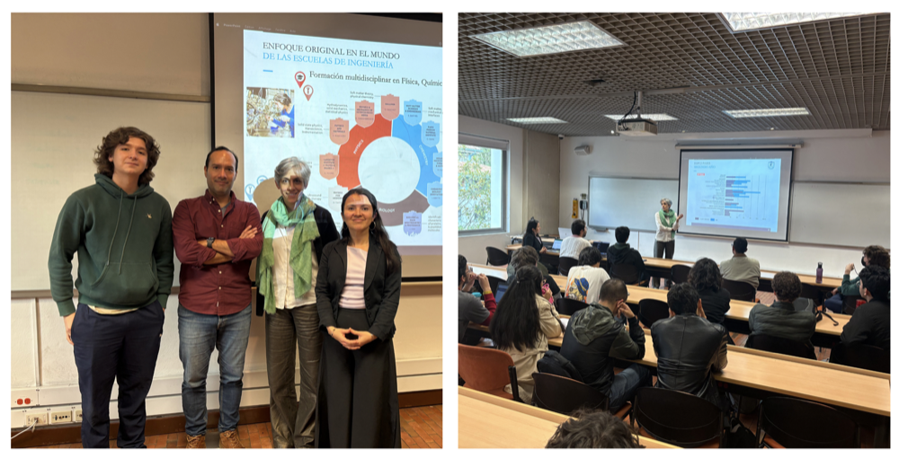

# 🖼️ Guía de Optimización de Imágenes - Sitio Web Titular

## 📊 Estado Actual: **~16MB** total de imágenes
## 🎯 Objetivo: **~3-4MB** total (reducción 75-80%)

---

## 🚨 **IMÁGENES CRÍTICAS A COMPRIMIR**

### **Prioridad 1 - Imágenes Más Pesadas (>1MB)**

| Archivo | Tamaño Actual | Target | Herramienta Recomendada |
|---------|---------------|--------|-------------------------|
| `placeholder-figura-6-3-2.png` | 3.0MB | 200KB | TinyPNG.com |
| `placeholder-figura-6-2-3.png` | 2.7MB | 200KB | TinyPNG.com |
| `image-3.png` | 1.5MB | 150KB | TinyPNG.com |
| `placeholder-uniandes-edificio.png` | 1.3MB | 250KB | TinyPNG.com |
| `placeholder-investigacion-bg.png` | 1.3MB | 250KB | TinyPNG.com |
| `teaching-hero-background.png` | 1.3MB | 250KB | TinyPNG.com |
| `profile-hero-background.png` | 1.3MB | 250KB | TinyPNG.com |
| `fondo_1.png` | 1.1MB | 200KB | TinyPNG.com |

### **Prioridad 2 - Imágenes Medianas (>500KB)**

| Archivo | Tamaño Actual | Target |
|---------|---------------|--------|
| `placeholder-vision-bg.png` | 908KB | 200KB |
| `foto.png` | 665KB | 100KB |
| `thumbnail-fisica-1.png` | 641KB | 80KB |
| `thumbnail-intro-fisica.png` | 579KB | 80KB |
| `placeholder-figura-5-2.png` | 526KB | 150KB |

---

## 🛠️ **MÉTODOS DE COMPRESIÓN**

### **Opción 1: Online (Más Fácil)**
1. **Visita:** https://tinypng.com/
2. **Arrastra** las imágenes más pesadas primero
3. **Descarga** las versiones optimizadas
4. **Reemplaza** los archivos originales

### **Opción 2: Herramientas Nativas macOS**
```bash
# Si tienes ImageOptim instalado
find figures/ -name "*.png" -exec /Applications/ImageOptim.app/Contents/MacOS/ImageOptim {} \;

# Con herramientas de línea de comandos (si están instaladas)
brew install pngquant imageoptim-cli
imageoptim --imagealpha --jpeg-mini --quit figures/
```

### **Opción 3: Conversión a WebP (Más Avanzado)**
```bash
# Instalar herramientas WebP
brew install webp

# Convertir imágenes grandes a WebP
for file in figures/placeholder-*.png figures/*-background.png; do
  cwebp -q 80 "$file" -o "${file%.png}.webp"
done
```

---

## ⚡ **AUTOMATIZACIÓN RECOMENDADA**

### **Script de Compresión Bash**
```bash
#!/bin/bash
# compress_images.sh

echo "🖼️ Optimizando imágenes del sitio web..."

# Crear backup
mkdir -p figures_backup
cp figures/*.png figures_backup/

# Comprimir con diferentes calidades según tipo
echo "📸 Comprimiendo imágenes de fondo..."
for file in figures/*-background.png figures/placeholder-*.png; do
  if [ -f "$file" ]; then
    echo "Procesando: $file"
    # Reducir a 80% calidad para fondos
    sips -Z 1920 --setProperty quality 0.8 "$file"
  fi
done

echo "👤 Comprimiendo foto de perfil..."
sips -Z 800 --setProperty quality 0.85 "foto.png"

echo "🎨 Comprimiendo thumbnails..."
for file in figures/thumbnail-*.png; do
  if [ -f "$file" ]; then
    sips -Z 400 --setProperty quality 0.8 "$file"
  fi
done

echo "✅ Optimización completada!"
```

---

## 🔧 **CONFIGURACIÓN PARA SITIO WEB**

### **CSS Lazy Loading (Añadir al CSS)**
```css
/* Lazy loading para imágenes */
img[data-src] {
  opacity: 0;
  transition: opacity 0.3s;
}

img[data-src].loaded {
  opacity: 1;
}
```

### **HTML con Lazy Loading**
```html
<!-- Ejemplo para imágenes grandes -->

```

---

## 📈 **IMPACTO ESPERADO**

### **Antes de Optimización:**
- 🐌 **Tiempo de carga:** 8-12 segundos
- 📱 **Experiencia móvil:** Muy pobre
- 💾 **Transferencia total:** ~16MB

### **Después de Optimización:**
- ⚡ **Tiempo de carga:** 2-3 segundos
- 📱 **Experiencia móvil:** Buena
- 💾 **Transferencia total:** ~3-4MB
- 🔋 **Ahorro datos móviles:** 75%

---

## 🎯 **PASOS INMEDIATOS**

1. **Backup:** Copiar carpeta `figures/` como `figures_backup/`
2. **Comprimir:** Las 8 imágenes más pesadas con TinyPNG
3. **Reemplazar:** Archivos originales con versiones optimizadas
4. **Verificar:** Que el sitio carga correctamente
5. **Medir:** Diferencia en velocidad de carga

---

## ⚠️ **NOTAS IMPORTANTES**

- **Siempre hacer backup** antes de optimizar
- **Verificar calidad visual** después de comprimir
- **Los placeholder-* pueden comprimirse agresivamente** (son temporales)
- **La foto de perfil necesita calidad alta** pero tamaño pequeño
- **Backgrounds pueden sacrificar calidad** por velocidad

---

**💡 TIP:** Empieza por las 4 imágenes más pesadas (figura-6-3-2, figura-6-2-3, image-3, uniandes-edificio) para obtener el 70% del beneficio con mínimo esfuerzo.